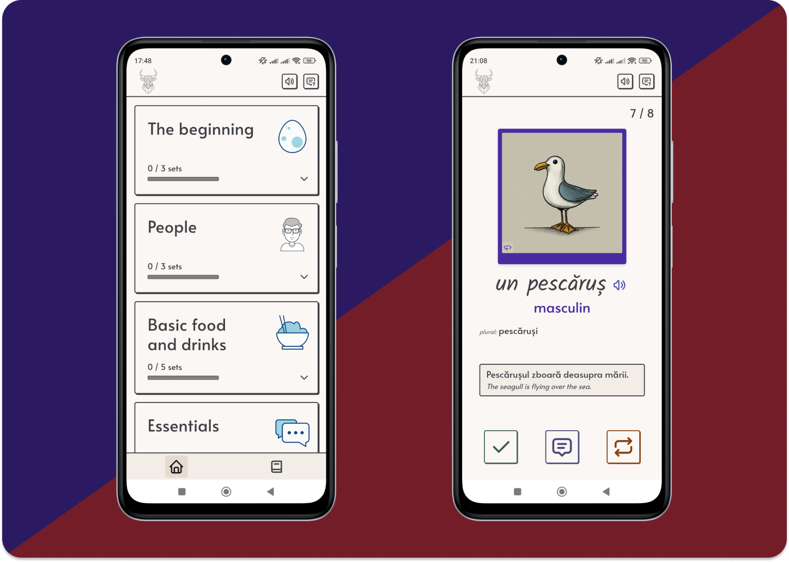

# Limba Vie

- [About us](#about)
- [Key features](#features)
- [Technologies used](#technologies)
- [Contacts](#contacts)
- [License](#license)

## About us 👨‍💻 

**Limba Vie** is a mobile web application designed to help users learn Romanian
words through fun and colorful flashcards.

We do out best to personalize your learning journey with intelligent features
and a user-friendly interface. Start using it
[**now**](https://limba.ravenplan.com)!

## Key features ⚙ 

- **Color Coding**: Easily identify the gender of nouns with colorful
  flashcards.
- **Progress Tracking**: Monitor your learning journey and track your progress.
- **AI-Generated Example Sentences**: Understand word usage in context with
  real-world example sentences generated by Gemini AI.
- **Comprehensive Dictionary**: Access all the words in the application, with
  indications of words you have already learned.
- **Concise Grammar Explanations**: Learn essential Romanian grammar concepts
  through clear and brief explanations.

## Technologies used ⌨️ 

At **Limba Vie** we use modern technologies to create an application that is
powerful, flexible, and easy to use. Our tech stack includes:

- [Next.js](https://nextjs.org) and [TypeScript](https://www.typescriptlang.org)
  for a fast and responsive frontend that is less prone to errors.
- [Supabase](https://supabase.com) for a scalable, easy-to-use and secure
  backend.
- [Gemini AI](https://gemini.google.com/) for generating contextually accurate
  example sentences.
- [Vercel](https://vercel.com) for scalable and reliable hosting.
- [Panda CSS](https://panda-css.com) - for a modern CSS-in-JS solution
  compatible with React Server Components.
- [Cloudinary](https://cloudinary.com) for image optimization and delivery.

## Contacts 📨 

If you want to get in touch, we will be glad to receive your e-mail 😉:
[limba@ravenplan.com](mailto:limba@ravenplan.com).

Follow us on [📷 Instagram](https://www.instagram.com/limba_vie)!

## License 🪪 

**Limba Vie** is licensed under the MIT License. See the
[LICENSE](https://github.com/Linkerin/limba-vie/blob/main/LICENSE) file for
details.
